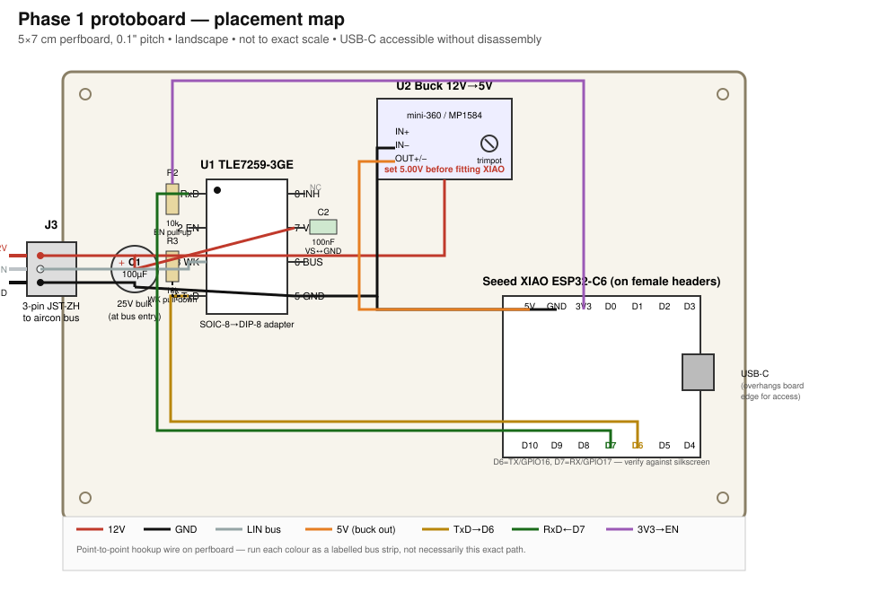

# Phase 1 board layout v2 — compact stripboard

Supersedes the first version of this doc. Two things changed based on
feedback:

1. **Perfboard → stripboard.** Plain perfboard (what `CLAUDE.md`'s BOM
   currently lists) has isolated pads and no copper to cut — every
   connection is a hand-run wire. There's nothing to "sever." If you want a
   board where copper traces need cutting, you need **stripboard**
   (Veroboard) — continuous copper strips, one per row/column, that you
   break with a spot-face cutter or knife where you don't want continuity.
   Same price bracket, same suppliers (Jaycar/AliExpress) — swap the BOM
   line for a 5×7cm stripboard sheet, cut down as below.
2. **Compact.** Using the strips themselves as the two power rails, plus
   one shared cut-line for every IC, cuts the board from the original
   ~50×70mm suggestion down to **~50×35mm** — half the area — and removes
   most of the point-to-point wiring the first version needed, since GND
   and 12V now ride on strips instead of individual wires.

## 1. How this board works

Strips run **vertically** — column 1 is one continuous copper strip from
row 1 to row 13, column 2 is another, etc., until you cut one. Two ideas
make this compact and hard to get wrong:

- **Columns 1 and 2 are dedicated rails** (GND and 12V) running the full
  height of the board, never cut. Anything needing GND or 12V gets a short
  wire to the nearest point on the relevant rail — you never have to trace
  a rail's path, it's the same net top to bottom.
- **Every IC/module is mounted so its two pin rows land 3+ rows apart on
  the same set of columns** (standard DIP orientation), which means a
  single cut, in a single straight line across the board, done once,
  separates every top pin from the bottom pin sharing its column. You are
  not hunting for different cut points per component — there is exactly
  **one cut-line** on this whole board.

## 2. The one cut-line

> **Cut every strip from column 3 to column 20, once, between row 3 and
> row 4. Do not cut columns 1 or 2.**

That's 18 cuts in a dead-straight line (a stripboard spot-face cutter does
this as 18 quick twists in a row; a hobby knife works too — scrape/cut the
copper between the two holes and check with a multimeter that continuity
is actually broken). Two of those cuts are load-bearing and not optional:

- **Column 17** separates XIAO's unused `D0` (top) from `D7`/RX (bottom) —
  without this cut, the RxD line from the transceiver is shorted to
  whatever `D0` is doing.
- **Column 18** does the same for `D1` (top) vs `D6`/TX (bottom).

Every other cut on the line is either isolating a real second signal (U1's
four pins) or a no-op (buck converter only uses one row; several XIAO pins
go unused) — but cutting the *entire* line uniformly means there's only one
rule to remember, instead of a list of exceptions to get right.

## 3. Component placement (grid references match the SVG)

Columns numbered 1–20 left→right, rows 1–13 top→bottom, 0.1"/2.54mm pitch.
Final cut stripboard: 20 holes × 13 holes ≈ **50.8 × 33mm**.

| Zone | Columns | Rows | Notes |
|---|---|---|---|
| GND rail | 1 | 1–13 | uncut |
| 12V rail | 2 | 1–13 | uncut |
| U2 buck converter | 4–7 | 2 (single pin row) | body can overhang rows 1–4 freely |
| U1 TLE7259-3GE (DIP-8 adapter) | 9–12 | 2 (top pins) / 5 (bottom pins) | pin-1 dot at column 9 |
| XIAO ESP32-C6 (female headers) | 14–20 | 2 (top row) / 9 (bottom row) | USB-C overhangs the right board edge |

### U1 pinout on the grid (verified against Infineon's product brief)

| Column | Row 2 (top) | Row 5 (bottom) |
|---|---|---|
| 9 | 1 RxD | 8 INH *(NC)* |
| 10 | 2 EN | 7 BUS (LIN) |
| 11 | 3 WK | 6 VS (12V) |
| 12 | 4 TxD | 5 GND |

### XIAO header on the grid

| Column | Row 2 (top) | Row 9 (bottom) |
|---|---|---|
| 14 | 5V | D10 *(unused)* |
| 15 | GND | D9 *(unused)* |
| 16 | 3V3 | D8 *(unused)* |
| 17 | D0 *(unused)* | **D7 / RX / GPIO17** |
| 18 | D1 *(unused)* | **D6 / TX / GPIO16** |
| 19 | D2 *(unused)* | D5 *(unused)* |
| 20 | D3 *(unused)* | D4 *(unused)* |

Wire to the pin **labels** silkscreened on the XIAO board itself — the
top/bottom assignment above is the standard XIAO-family header order, not
independently confirmed for this specific board revision.

## 4. Passives (no extra wire needed — they bridge holes directly)

| Part | Leg A | Leg B |
|---|---|---|
| R2 10 kΩ (EN pull-up) | col 10, row 1 | col 10, row 2 (EN pin) |
| R3 10 kΩ (WK pull-down) | col 11, row 2 (WK pin) | col 12, row 5 (U1's own GND pin) — diagonal lead, that's fine |
| C2 100 nF (VS↔GND decoupling) | col 11, row 5 (VS) | col 12, row 5 (GND) — adjacent holes, shortest possible lead |
| C1 100 µF/25V (bulk, at bus entry) | GND rail (col 1) | 12V rail (col 2), near row 1 |

## 5. Wire list (everything that isn't a rail or a passive leg)

| # | Net | From | To |
|---|---|---|---|
| 1 | 12V in | J3 red lead | col 2 (12V rail), row 1 |
| 2 | GND in | J3 black lead | col 1 (GND rail), row 1 |
| 3 | LIN | J3 white lead | col 10, row 5 (U1 BUS pin) |
| 4 | 12V | col 4, row 2 (buck IN+) | col 2 rail |
| 5 | GND | col 5, row 2 (buck IN−) | col 1 rail |
| 6 | GND | col 6, row 2 (buck OUT−) | col 1 rail |
| 7 | 5V | col 7, row 2 (buck OUT+) | col 14, row 2 (XIAO 5V) |
| 8 | RXD | col 9, row 2 (U1 RxD) | col 17, row 9 (XIAO D7) |
| 9 | TXD | col 12, row 2 (U1 TxD) | col 18, row 9 (XIAO D6) |
| 10 | 12V | col 11, row 5 (U1 VS) | col 2 rail |
| 11 | GND | col 12, row 5 (U1 GND) | col 1 rail |
| 12 | EN | col 10, row 1 (R2's free leg) | col 16, row 2 (XIAO 3V3) |
| 13 | GND | col 15, row 2 (XIAO GND) | col 1 rail |

13 wires total, none of them ambiguous — every entry names a hole by
column/row, not "wherever looks right." Insulated hookup wire can cross
over other holes/columns on its way between two points without touching
them; only the two named ends get soldered/stripped.

## 6. Build/verify order

1. Cut the stripboard to 20×13 holes (~50×33mm) and drill/file the two
   mounting-hole corners.
2. Make the 18 cuts in row 3/4 first, **before placing any parts** — much
   easier to see and to check with a multimeter (probe adjacent holes in
   each cut column; should read open/infinite resistance) while the board
   is bare.
3. Solder U1 onto its DIP-8 adapter separately, inspect under a loupe, then
   fit it and the buck module's header pins.
4. Populate R2, R3, C1, C2, then the female headers for the XIAO — XIAO
   itself stays out of the socket.
5. Wire items 1–13 from the table above.
6. **Before fitting the XIAO:** power the board from a bench supply (or
   12V with the LIN wire disconnected), confirm the two rails read 12V and
   0V where expected, then trim the buck's pot until its output pin reads
   **exactly 5.00V** against GND.
7. Multimeter continuity check of every row in §5 against the physical
   board — cheap insurance before anything expensive is at risk.
8. Socket the XIAO, flash and verify over USB with the aircon bus still
   disconnected, then connect to the aircon with the breaker off per
   `CLAUDE.md`. Unplug USB before running from aircon 12V.

## 7. What's still an assumption

Same two caveats as v1, unchanged by this revision:

- **WK pin treatment** (pull-down to GND) is standard practice for an
  unused LIN local-wake input, not confirmed against TLE7259-3GE's full
  datasheet (I only had Infineon's product brief) — check before first
  power-up from the aircon bus.
- **Buck module pin order** (IN+/IN−/OUT−/OUT+) varies between mini-360
  clone batches — confirm against the silkscreen on the specific module you
  received before wiring items 4–7.
